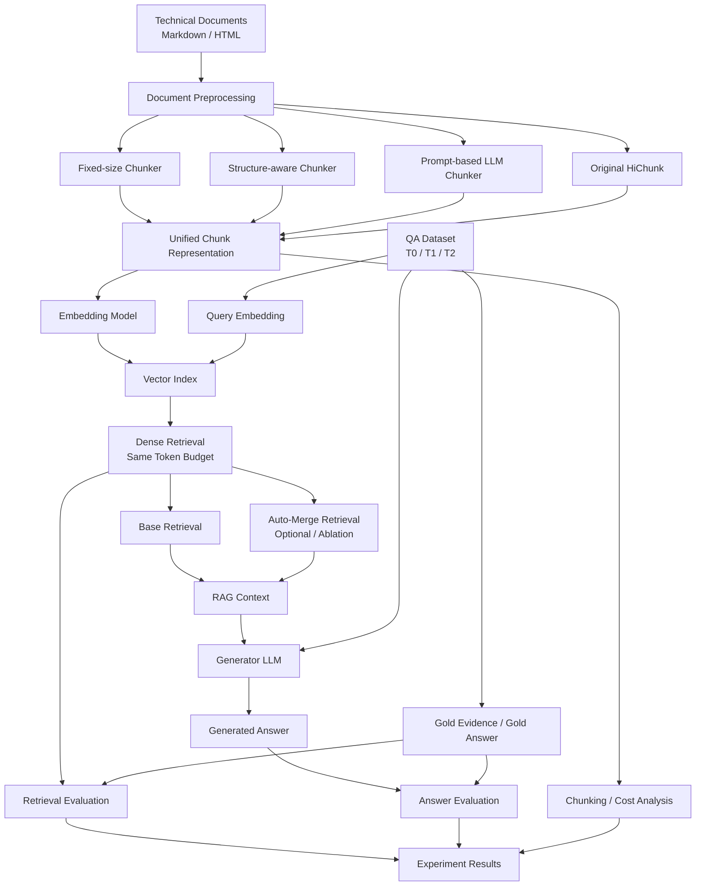

# System Architecture
## Structure-Aware Chunking for RAG on Technical Documents

## 1. Mục tiêu hệ thống

Hệ thống được xây dựng để so sánh các chiến lược chunking khác nhau trong Retrieval-Augmented Generation (RAG) đối với **tài liệu kỹ thuật có cấu trúc tường minh**, ví dụ Markdown/HTML có heading, section và subsection.

Nghiên cứu tập trung vào câu hỏi:

> Với tài liệu kỹ thuật vốn đã có cấu trúc rõ ràng, một phương pháp chunking dựa trực tiếp trên cấu trúc tài liệu có thể đạt chất lượng retrieval và RAG tương đương với các phương pháp hierarchical chunking dựa trên LLM hay không, trong khi có chi phí xử lý thấp hơn?

Hệ thống so sánh bốn phương pháp:

1. **Fixed-size Chunking** — baseline đơn giản.
2. **Structure-aware Chunking** — sử dụng heading/section có sẵn.
3. **Prompt-based Hierarchical Chunking** — LLM suy luận chunk boundary và hierarchy bằng prompting, lấy cảm hứng từ HiChunk nhưng không fine-tune.
4. **Original HiChunk** — phương pháp gốc của paper, sử dụng fine-tuned hierarchical chunker, dùng làm reference method.

---

# 2. High-Level Architecture



---

# 3. Pipeline tổng thể

```text
Technical Documents
        |
        v
+----------------------+
| Document Preprocess  |
+----------------------+
        |
        +---------------------+----------------------+----------------------+--------------------+
        |                     |                      |                      |
        v                     v                      v                      v
 Fixed-size              Structure-aware        Prompt-based          Original
 Chunking                   Chunking             LLM Chunking          HiChunk
        |                     |                      |                      |
        +---------------------+----------------------+----------------------+
                                      |
                                      v
                           Unified Chunk Format
                                      |
                                      v
                               Embedding Model
                                      |
                                      v
                                Vector Index
                                      |
                      Question -------+
                                      |
                                      v
                                Dense Retrieval
                          Same Retrieval Token Budget
                                      |
                             +--------+--------+
                             |                 |
                             v                 v
                       Base Retrieval      Auto-Merge
                                           (Ablation)
                             |                 |
                             +--------+--------+
                                      |
                                      v
                                  Context
                                      |
                                      v
                              Generator LLM
                                      |
                                      v
                                   Answer
                                      |
                 +--------------------+--------------------+
                 |                                         |
                 v                                         v
         Retrieval Evaluation                      Answer Evaluation
         Evidence Recall                           F1 / ROUGE-L
                 |                                         |
                 +--------------------+--------------------+
                                      |
                                      v
                              Final Comparison
```

---

# 4. Module 1 — Document Collection

## Input

Sử dụng khoảng **10–12 tài liệu kỹ thuật thực tế**.

Ưu tiên tài liệu:

- Markdown;
- HTML có heading rõ ràng;
- technical documentation của cùng một ecosystem hoặc cùng một loại tài liệu.

Ví dụ cấu trúc:

```text
data/
└── documents/
    ├── doc01.md
    ├── doc02.md
    ├── doc03.md
    └── ...
```

Mỗi document cần giữ lại:

- heading;
- section;
- subsection;
- paragraph;
- code block nếu cần thiết cho nội dung;
- thứ tự nội dung gốc.

Không loại bỏ cấu trúc heading vì đây là tín hiệu đầu vào quan trọng cho Structure-aware Chunking.

---

# 5. Module 2 — Document Preprocessing

Mục tiêu preprocessing là chuẩn hóa dữ liệu nhưng không làm mất cấu trúc tài liệu.

Pipeline:

```text
Markdown / HTML
      |
      v
Remove navigation / footer / irrelevant elements
      |
      v
Normalize whitespace
      |
      v
Extract structural blocks
      |
      v
Sentence segmentation
      |
      v
Normalized Document
```

Representation trung gian:

```json
{
  "doc_id": "doc01",
  "blocks": [
    {
      "type": "heading",
      "level": 1,
      "text": "Authentication"
    },
    {
      "type": "paragraph",
      "text": "Authentication allows..."
    },
    {
      "type": "heading",
      "level": 2,
      "text": "OAuth2"
    }
  ]
}
```

Preprocessing phải giống nhau cho tất cả chunking methods để đảm bảo so sánh công bằng.

---

# 6. Module 3 — Chunking Strategies

## 6.1 Fixed-size Chunking

Đây là baseline đơn giản nhất.

Pipeline:

```text
Document
   |
   v
Tokenizer
   |
   v
Fixed Token Window
   |
   v
Chunks
```

Ví dụ cấu hình ban đầu:

```text
chunk_size = 512 tokens
overlap = 64 tokens
```

Phương pháp này:

- không sử dụng heading;
- không sử dụng hierarchy;
- không sử dụng LLM.

Output:

```text
Chunk 1: token 0 - 511
Chunk 2: token 448 - 959
Chunk 3: token 896 - 1407
...
```

---

## 6.2 Structure-aware Chunking

Phương pháp sử dụng trực tiếp cấu trúc heading có sẵn trong Markdown/HTML.

Ví dụ:

```text
# Authentication
## OAuth2
### Access Token
### Refresh Token
## API Key
```

được chuyển thành:

```text
Authentication
├── OAuth2
│   ├── Access Token
│   └── Refresh Token
└── API Key
```

Pipeline:

```text
Document
   |
   v
Heading Parser
   |
   v
Hierarchy Tree
   |
   v
Section-based Chunking
   |
   v
Split Oversized Sections
   |
   v
Hierarchical Chunks
```

Nếu một section quá lớn:

```text
section > max_chunk_size
```

thì split tiếp dựa trên:

1. subsection;
2. paragraph;
3. sentence boundary.

Phương pháp này không sử dụng LLM.

---

## 6.3 Prompt-based Hierarchical Chunking

Phương pháp này lấy ý tưởng từ HiChunk nhưng **không fine-tune model**.

Document được chia thành sentence và đánh ID:

```text
0 @ Authentication provides...
1 @ OAuth2 is...
2 @ Access tokens are...
3 @ Refresh tokens are...
4 @ API key authentication...
```

LLM nhận các sentence và xác định:

- chunk boundary;
- hierarchy level.

Ví dụ output:

```text
0, Level One
1, Level Two
2, Level Three
4, Level Two
```

Sau đó hệ thống dựng lại hierarchy:

```text
Authentication
├── OAuth2
│   ├── Access Token
│   └── Refresh Token
└── API Key
```

Pipeline:

```text
Document
   |
   v
Sentence Segmentation
   |
   v
Sentence ID Assignment
   |
   v
Prompt LLM
   |
   v
Boundary + Level Prediction
   |
   v
Output Parser
   |
   v
Hierarchy Tree
   |
   v
Hierarchical Chunks
```

Khác với HiChunk gốc:

```text
Original HiChunk:
Fine-tuned model
+ hierarchical prediction
+ iterative inference

Our Prompt-based Method:
General instruction LLM
+ prompting only
+ no fine-tuning
+ no iterative inference
```

Iterative inference được bỏ trong phạm vi bài tập vì corpus chỉ gồm các tài liệu có độ dài vừa phải.

---

## 6.4 Original HiChunk

HiChunk gốc được sử dụng như **reference method**.

Mục đích không phải để chứng minh phương pháp của chúng ta giống HiChunk, mà để trả lời:

> Các phương pháp nhẹ hơn có thể đạt gần chất lượng của HiChunk gốc đến mức nào?

Pipeline:

```text
Document
   |
   v
Sentence Segmentation
   |
   v
Fine-tuned HiChunk Model
   |
   v
Hierarchical Chunk Points
   |
   v
Hierarchy Tree
   |
   v
HiChunk Chunks
```

HiChunk original khác ba phương pháp còn lại ở việc sử dụng model đã fine-tune chuyên biệt cho nhiệm vụ hierarchical document chunking.

Do đó HiChunk được xem là:

```text
Reference Method
```

thay vì baseline có cùng computational condition.

---

# 7. Unified Chunk Representation

Tất cả chunking methods phải trả output về cùng một format.

Ví dụ:

```json
{
  "chunk_id": "doc01_chunk005",
  "doc_id": "doc01",
  "text": "Access tokens are used...",
  "level": 3,
  "parent_id": "doc01_chunk003",
  "token_count": 287,
  "title_path": [
    "Authentication",
    "OAuth2",
    "Access Token"
  ]
}
```

Interface tổng quát:

```text
Chunk
├── chunk_id
├── doc_id
├── text
├── token_count
├── level
├── parent_id
├── children_ids
└── title_path
```

Đối với Fixed-size:

```text
level = 0
parent_id = null
children_ids = []
title_path = []
```

Điều này cho phép toàn bộ retrieval pipeline phía sau không cần biết chunk được sinh bởi phương pháp nào.

---

# 8. Module 4 — Embedding

Tất cả các chunk được embed bằng **cùng một embedding model**.

Pipeline:

```text
Chunk Text
    |
    v
Embedding Model
    |
    v
Dense Vector
```

Embedding model cần được giữ cố định cho toàn bộ experiment.

Ví dụ:

```text
BAAI/bge-small-en-v1.5
```

hoặc một embedding model nhẹ tương đương.

---

# 9. Module 5 — Vector Index

Các chunk embeddings được lưu trong vector index.

Có thể sử dụng:

```text
FAISS
```

Không cần triển khai vector database phức tạp.

Mỗi phương pháp chunking có index riêng:

```text
indexes/
├── fixed/
├── structure/
├── prompt_llm/
└── hichunk/
```

---

# 10. Module 6 — QA Benchmark

Tạo một mini benchmark gồm khoảng:

```text
60 QA pairs
```

chia đều:

```text
T0 = 20
T1 = 20
T2 = 20
```

Theo taxonomy của HiChunk:

### T0 — Evidence Sparse

Evidence chỉ nằm trong khoảng 1–2 câu.

### T1 — Single-Chunk Evidence Dense

Nhiều evidence liên quan nằm trong cùng một semantic region.

### T2 — Multi-Chunk Evidence Dense

Evidence cần thiết nằm ở nhiều semantic regions hoặc nhiều chunks khác nhau.

QA schema:

```json
{
  "id": "q001",
  "doc_id": "doc01",
  "type": "T1",
  "question": "How do access tokens and refresh tokens differ?",
  "answer": "...",
  "evidence_sentences": [
    "...",
    "...",
    "..."
  ],
  "evidence_sections": [
    "Authentication > OAuth2 > Access Token",
    "Authentication > OAuth2 > Refresh Token"
  ]
}
```

QA có thể được LLM sinh nháp, nhưng phải được kiểm tra thủ công trước khi đưa vào experiment.

---

# 11. Module 7 — Retrieval

Query được embed bằng cùng embedding model:

```text
Question
   |
   v
Query Embedding
   |
   v
Cosine Similarity
   |
   v
Ranked Chunks
```

Không sử dụng cùng `top-k` làm điều kiện chính vì chunk sizes giữa các phương pháp khác nhau.

Thay vào đó sử dụng:

```text
Same Retrieval Token Budget
```

Ví dụ:

```text
retrieval_token_budget = 2048
```

Pipeline:

```text
Rank chunks by similarity
          |
          v
Take highest ranked chunk
          |
          v
Add next chunk
          |
          v
...
          |
          v
Stop when total context reaches token budget
```

Điều này đảm bảo các chunking methods nhận cùng lượng context tối đa.

---

# 12. Module 8 — Auto-Merge Retrieval

Auto-Merge không nằm trong main experiment đầu tiên mà được dùng như một **ablation experiment**.

Ví dụ hierarchy:

```text
OAuth2
├── Access Token      <-- retrieved
├── Refresh Token     <-- retrieved
└── Validation
```

Nếu nhiều child của cùng một parent được retrieve:

```text
matched_children >= 2
```

và parent vẫn nằm trong token budget:

```text
parent_tokens <= remaining_budget
```

thì:

```text
Access Token + Refresh Token
            |
            v
          OAuth2
```

Bản đơn giản:

```python
if matched_children >= 2 and parent_fits_budget:
    merge_to_parent()
```

Main experiment:

```text
Fixed
Structure
Prompt-LLM
HiChunk
```

Ablation experiment:

```text
Structure
Structure + Auto-Merge

Prompt-LLM
Prompt-LLM + Auto-Merge

HiChunk
HiChunk + Auto-Merge
```

---

# 13. Module 9 — RAG Generation

Retrieved context được đưa cùng question vào một generator LLM.

Pipeline:

```text
Question
   +
Retrieved Context
   |
   v
Generator LLM
   |
   v
Generated Answer
```

Prompt:

```text
Answer the question using only the provided context.

Context:
{context}

Question:
{question}

Answer:
```

Các điều kiện phải giữ giống nhau:

```text
same generator
same prompt
same temperature
same max output tokens
same retrieval token budget
```

Chỉ chunking strategy thay đổi.

---

# 14. Module 10 — Evaluation

Evaluation được chia thành ba tầng.

---

## 14.1 Chunking Analysis

Mục tiêu là phân tích đặc tính của từng chunking method.

Metrics:

```text
Average Chunk Size
Number of Chunks
Chunk Size Distribution
Hierarchy Depth
Chunking Time
LLM Calls
Estimated Token Cost
```

Boundary F1 có thể được sử dụng như secondary metric nếu có human annotation cho semantic boundaries.

---

## 14.2 Retrieval Evaluation

Metric chính:

```text
Evidence Recall
```

Ví dụ gold evidence:

```text
E1
E2
E3
E4
```

retrieved context chứa:

```text
E1
E2
E4
```

thì:

```text
Evidence Recall = 3 / 4 = 0.75
```

Kết quả được tính riêng:

```text
T0
T1
T2
Overall
```

---

## 14.3 End-to-End RAG Evaluation

Generated answer được so với gold answer.

Metrics:

```text
Answer F1
ROUGE-L
```

Có thể bổ sung Exact Match đối với câu trả lời ngắn nếu cần.

---

# 15. Experimental Design

Main experiment:

```text
                  Same Documents
                       |
        +--------------+--------------+--------------+
        |              |              |              |
      Fixed        Structure       Prompt-LLM      HiChunk
        |              |              |              |
        +--------------+--------------+--------------+
                       |
                 Same Embedding
                       |
                 Same Retrieval
                       |
              Same Token Budget
                       |
                 Same Generator
                       |
                 Same QA Dataset
                       |
                 Same Evaluation
```

Biến độc lập:

```text
Chunking Strategy
```

Các biến được giữ cố định:

```text
Corpus
QA Dataset
Embedding Model
Similarity Metric
Retrieval Token Budget
Generator LLM
Generation Prompt
Evaluation Metrics
```

---

# 16. Main Experiment Matrix

| Method | Fine-tune | Uses Explicit Structure | Uses LLM | Hierarchical |
|---|---:|---:|---:|---:|
| Fixed-size | No | No | No | No |
| Structure-aware | No | Yes | No | Yes |
| Prompt-based LLM | No | Optional | Yes | Yes |
| Original HiChunk | Yes | No / Semantic inference | Yes | Yes |

---

# 17. Expected Result Tables

## Retrieval Quality

| Method | T0 Evidence Recall | T1 Evidence Recall | T2 Evidence Recall | Average |
|---|---:|---:|---:|---:|
| Fixed | | | | |
| Structure | | | | |
| Prompt-LLM | | | | |
| HiChunk | | | | |

---

## RAG Answer Quality

| Method | T0 F1 | T1 F1 | T2 F1 | ROUGE-L |
|---|---:|---:|---:|---:|
| Fixed | | | | |
| Structure | | | | |
| Prompt-LLM | | | | |
| HiChunk | | | | |

---

## Efficiency

| Method | Time / Document | LLM Calls | Input Tokens | Relative Cost |
|---|---:|---:|---:|---:|
| Fixed | | 0 | 0 | |
| Structure | | 0 | 0 | |
| Prompt-LLM | | | | |
| HiChunk | | | | |

---

# 18. Research Questions

## RQ1

> Structure-aware chunking có cải thiện retrieval và RAG so với fixed-size chunking trên technical documents hay không?

So sánh:

```text
Fixed vs Structure
```

---

## RQ2

> Prompt-based hierarchical chunking có cải thiện chất lượng so với deterministic structure-aware chunking hay không?

So sánh:

```text
Structure vs Prompt-LLM
```

---

## RQ3

> Một phương pháp không fine-tune có thể đạt gần chất lượng của HiChunk gốc đến mức nào?

So sánh:

```text
Structure vs HiChunk

Prompt-LLM vs HiChunk
```

---

## RQ4

> Hierarchical Auto-Merge có cải thiện retrieval trên các câu hỏi evidence-dense hay không?

So sánh:

```text
Base Retrieval
vs
Base Retrieval + Auto-Merge
```

đặc biệt trên:

```text
T1
T2
```

---

# 19. Expected Contribution

Bài tập không nhằm đề xuất một replacement hoàn chỉnh cho HiChunk.

Đóng góp chính là một empirical study cho trường hợp đặc biệt:

```text
Technical Documents
+
Explicit Document Structure
```

Nghiên cứu kiểm tra giả thuyết rằng:

> Khi tài liệu đã chứa strong structural signals như heading và section hierarchy, một deterministic structure-aware chunker có thể giữ được phần lớn lợi ích của hierarchical chunking với chi phí thấp hơn đáng kể so với LLM-based approaches.

Đồng thời Prompt-based LLM Chunker cho phép đánh giá khoảng cách giữa:

```text
No LLM
        ↓
Prompt-only LLM
        ↓
Fine-tuned HiChunk
```

---

# 20. Final System Pipeline

```text
                           TECHNICAL DOCUMENTS
                                  |
                                  v
                           PREPROCESSING
                                  |
          +-----------------------+------------------------+
          |                       |                        |
          v                       v                        v
     FIXED-SIZE              STRUCTURE-AWARE          PROMPT-LLM
       CHUNKER                   CHUNKER                CHUNKER
          |                       |                        |
          |                       |                        |
          +-----------------------+------------------------+
                                  |
                         +--------+--------+
                         |                 |
                         v                 |
                    ORIGINAL              |
                     HICHUNK               |
                         |                 |
                         +--------+--------+
                                  |
                                  v
                         UNIFIED CHUNK FORMAT
                                  |
                                  v
                             EMBEDDING
                                  |
                                  v
                           VECTOR INDEX
                                  |
                 QUESTION --------+
                                  |
                                  v
                           DENSE RETRIEVAL
                       SAME TOKEN BUDGET
                                  |
                     +------------+------------+
                     |                         |
                     v                         v
               BASE RETRIEVAL              AUTO-MERGE
                                            ABLATION
                     |                         |
                     +------------+------------+
                                  |
                                  v
                              CONTEXT
                                  |
                                  v
                           GENERATOR LLM
                                  |
                                  v
                               ANSWER
                                  |
              +-------------------+--------------------+
              |                   |                    |
              v                   v                    v
         CHUNK ANALYSIS     RETRIEVAL METRICS    ANSWER METRICS
         Time / Cost        Evidence Recall       F1 / ROUGE-L
              |                   |                    |
              +-------------------+--------------------+
                                  |
                                  v
                         FINAL COMPARISON

             Fixed vs Structure vs Prompt-LLM vs HiChunk
```

---

# 21. Scope của bài tập

## Trong scope

- Technical document collection.
- Document preprocessing.
- Fixed-size chunking.
- Structure-aware hierarchical chunking.
- Prompt-based LLM hierarchical chunking.
- Original HiChunk inference.
- Dense embedding retrieval.
- Evidence Recall evaluation.
- End-to-end RAG generation.
- F1 / ROUGE-L evaluation.
- Efficiency / cost comparison.
- Auto-Merge ablation nếu đủ thời gian.

## Ngoài scope

- Fine-tune model mới.
- Reproduce toàn bộ training procedure của HiChunk.
- Rebuild toàn bộ HiCBench.
- Fact-Cov evaluation lặp nhiều lần như paper.
- Multiple retrievers.
- Multiple generator LLMs.
- Extremely long document iterative inference cho phương pháp của chúng ta.
- Production vector database.

---

# 22. Nguyên tắc quan trọng nhất của experiment

Để đảm bảo fair comparison:

> **Chỉ thay đổi Chunking Strategy.**

Các thành phần downstream phải được giữ cố định:

```text
Same Documents
Same QA
Same Embedding
Same Retrieval Algorithm
Same Retrieval Token Budget
Same Generator
Same Prompt
Same Metrics
```

Nhờ đó, sự khác biệt trong kết quả có thể được phân tích chủ yếu từ ảnh hưởng của chiến lược chunking.
