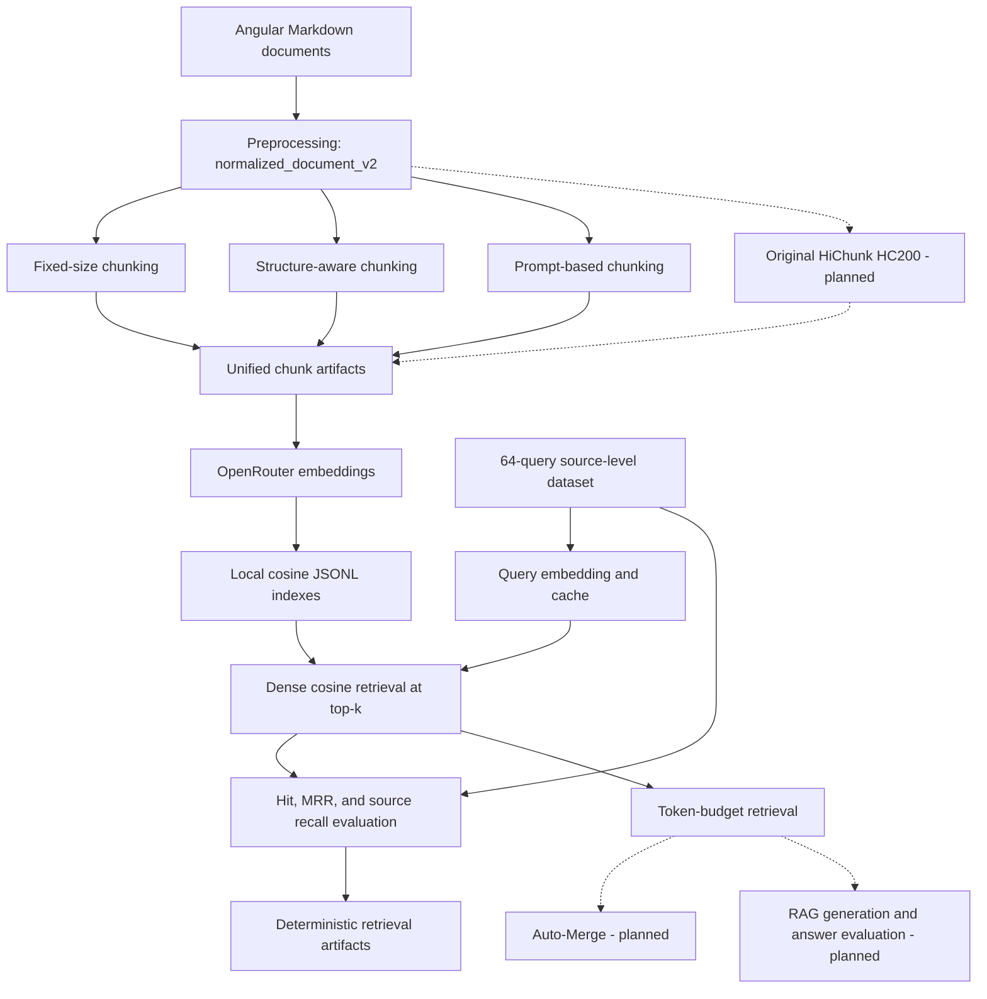

# System Architecture

For the audited fair retrieval protocols, token-budget semantics, external QA
adapter, evidence mapping, frozen fingerprints, and compatibility gate, see
[`RETRIEVAL_PROTOCOL_AUDIT.md`](RETRIEVAL_PROTOCOL_AUDIT.md).
## Structure-Aware Chunking for RAG on Technical Documents

## 1. Mục tiêu hệ thống

Hệ thống được xây dựng để so sánh các chiến lược chunking khác nhau trong Retrieval-Augmented Generation (RAG) đối với **tài liệu kỹ thuật có cấu trúc tường minh**, ví dụ Markdown/HTML có heading, section và subsection.

Nghiên cứu tập trung vào câu hỏi:

> Với tài liệu kỹ thuật vốn đã có cấu trúc rõ ràng, một phương pháp chunking dựa trực tiếp trên cấu trúc tài liệu có thể đạt chất lượng retrieval và RAG tương đương với các phương pháp hierarchical chunking dựa trên LLM hay không, trong khi có chi phí xử lý thấp hơn?

Kiến trúc thí nghiệm mục tiêu so sánh bốn phương pháp:

1. **Fixed-size Chunking** — baseline đơn giản.
2. **Structure-aware Chunking** — sử dụng heading/section có sẵn.
3. **Prompt-based Hierarchical Chunking** — LLM suy luận chunk boundary và hierarchy bằng prompting, lấy cảm hứng từ HiChunk nhưng không fine-tune.
4. **Original HiChunk (HC200)** — cấu hình tham chiếu từ paper: hierarchy do fine-tuned HiChunk model tạo ra được split thêm theo fixed-size khoảng 200 tokens.

> **Trạng thái code hiện tại:** repository đã triển khai và tạo artifact cho
> Fixed-size, Structure-aware và Prompt-based. Original HiChunk (HC200),
> Auto-Merge, RAG generation và đánh giá answer vẫn là thiết kế mục tiêu.
> Dense retrieval hiện hỗ trợ cả top-k lịch sử và ngân sách token hậu xếp hạng;
> evidence-aware evaluation dùng QA contract bên ngoài, trong khi baseline cũ
> vẫn dùng gold label ở mức đường dẫn tài liệu.

---

# 2. High-Level Architecture



Mũi tên liền biểu diễn luồng đã có trong code; mũi tên nét đứt biểu diễn phần
`planned`, được mô tả trong thiết kế nhưng chưa được triển khai.

## 2.1 Implementation status

| Thành phần | Trạng thái hiện tại | Bằng chứng trong repository |
|---|---|---|
| Preprocessing | Đã triển khai | `rag_chunking.data`, 384 documents trong processed manifest |
| Fixed-size | Đã triển khai | `rag_chunking.chunking.fixed_size`, 1.300 chunks |
| Structure-aware | Đã triển khai | `rag_chunking.chunking.structure_aware`, 3.162 chunks |
| Prompt-based | Đã triển khai qua CLI riêng | `chunk_prompt`; artifact hiện có 2.054 chunks dùng prompt v1, trong khi code mặc định hiện là `prompt_based_v2`; chưa nằm trong orchestrator config mặc định |
| Embedding và index | Đã triển khai | OpenRouter embeddings, backend `local_cosine_jsonl` |
| Dense retrieval evaluation | Đã triển khai | 64 queries, top-k=10, label ở mức `relative_path` |
| Original HiChunk HC200 | Chưa triển khai | Chưa có chunker, CLI hoặc artifact |
| Token-budget retrieval | Đã triển khai | `rag_chunking.retrieval.protocols`; hậu xử lý cùng dense ranking |
| Auto-Merge | Chưa triển khai | Ngoài phạm vi primary experiment |
| RAG generation / answer evaluation | Chưa triển khai | Chưa có generator hoặc Answer F1/ROUGE-L runner |

---

# 3. Pipeline tổng thể dự kiến

Sơ đồ dưới đây là pipeline đích của main experiment. Với luồng đã chạy được ở
trạng thái hiện tại, xem sơ đồ và bảng trạng thái tại mục 2.

```text
Technical Documents
        |
        v
+----------------------+
| Document Preprocess  |
+----------------------+
        |
        +---------------------+----------------------+----------------------+--------------------+
        |                     |                      |                      |
        v                     v                      v                      v
 Fixed-size              Structure-aware        Prompt-based          Original HiChunk
 Chunking                   Chunking             LLM Chunking          (HC200)
        |                     |                      |                      |
        +---------------------+----------------------+----------------------+
                                      |
                                      v
                           Unified Chunk Format
                                      |
                                      v
                               Embedding Model
                                      |
                                      v
                                Vector Index
                                      |
                      Question -------+
                                      |
                                      v
                                Dense Retrieval
                          Same Retrieval Token Budget
                                      |
                             +--------+--------+
                             |                 |
                             v                 v
                       Base Retrieval      Hierarchical Retrieval
                                           (AM Ablation)
                             |                 |
                             +--------+--------+
                                      |
                                      v
                                  Context
                                      |
                                      v
                              Generator LLM
                                      |
                                      v
                                   Answer
                                      |
                 +--------------------+--------------------+
                 |                                         |
                 v                                         v
         Retrieval Evaluation                      Answer Evaluation
         Evidence Recall                           F1 / ROUGE-L
                 |                                         |
                 +--------------------+--------------------+
                                      |
                                      v
                              Final Comparison
```

---

# 4. Module 1 — Document Collection

## Input

Corpus hiện tại gồm **384 tài liệu Markdown của Angular**. Mỗi experiment phải
pin cùng một corpus snapshot và `source_sha256`; nếu dùng subset thì phải lưu rõ
danh sách đường dẫn trong experiment manifest.

Ưu tiên tài liệu:

- Markdown;
- HTML có heading rõ ràng;
- technical documentation của cùng một ecosystem hoặc cùng một loại tài liệu.

Ví dụ cấu trúc:

```text
data/
└── documents/
    ├── doc01.md
    ├── doc02.md
    ├── doc03.md
    └── ...
```

Mỗi document cần giữ lại:

- heading;
- section;
- subsection;
- paragraph;
- code block nếu cần thiết cho nội dung;
- thứ tự nội dung gốc.

Không loại bỏ cấu trúc heading vì đây là tín hiệu đầu vào quan trọng cho Structure-aware Chunking.

---

# 5. Module 2 — Document Preprocessing

Mục tiêu preprocessing là chuẩn hóa dữ liệu nhưng không làm mất cấu trúc tài liệu.

Pipeline:

```text
Markdown / HTML
      |
      v
CommonMark/GFM block parsing
      |
      v
Angular docs-* normalization
      |
      v
Extract structural blocks
      |
      v
Sentence segmentation
      |
      v
Normalized Document
```

Representation trung gian:

```json
{
  "schema_version": "normalized_document_v2",
  "doc_id": "doc01",
  "blocks": [
    {
      "type": "heading",
      "level": 1,
      "text": "Authentication",
      "source_line_start": 1,
      "source_line_end": 1
    },
    {
      "type": "paragraph",
      "text": "Authentication allows..."
    },
    {
      "type": "heading",
      "level": 2,
      "text": "OAuth2"
    }
  ]
}
```

Implementation v2 dùng `markdown-it-py` cho CommonMark/GFM và một adapter riêng
cho Angular. Các block bổ sung gồm `callout`, `html_block`, `code_reference` và
`custom_block`. Workflow/step/tab/card được giữ trong `container_path`; table có
header/alignment/row metadata; link-reference definitions nằm ở document metadata
thay vì bị đưa vào embedding text. Các `docs-code path="..."` chưa có source file
được đánh dấu `resolved=false`, không giả lập nội dung code.

**All methods must operate on the same normalized source content, but each chunking method may construct its own required intermediate representation.** Cụ thể:

- Fixed-size có thể dùng tokenized continuous text;
- Structure-aware cần Markdown/HTML heading tree;
- Prompt-based LLM cần sentence segmentation và sentence IDs;
- HiChunk cần input representation phù hợp với implementation gốc.

Fairness nằm ở việc giữ nguyên cùng source content, không thêm hoặc bớt thông tin giữa các methods, và cố định downstream pipeline; không bắt buộc preprocessing implementation phải giống hệt nhau.

---

# 6. Module 3 — Chunking Strategies

## 6.1 Fixed-size Chunking

Đây là baseline đơn giản nhất.

Pipeline:

```text
Document
   |
   v
Tokenizer
   |
   v
Fixed Token Window
   |
   v
Chunks
```

Ví dụ cấu hình ban đầu:

```text
chunk_size = 512 tokens
overlap = 64 tokens
```

Phương pháp này:

- không sử dụng heading;
- không sử dụng hierarchy;
- không sử dụng LLM.

Implementation baseline của repository dùng `tiktoken==0.12.0` với encoding
`cl100k_base`. Mỗi normalized document được linearize bằng cách nối `text` của
mọi block theo source order với separator cố định `\n\n`, sau đó tokenize thành
một continuous stream. Default là window 512 tokens, overlap 64 tokens, stride
448 tokens; chunk cuối không pad hoặc merge. Span token dùng interval
`[token_start, token_end)` và được tính trực tiếp trên source token stream.
`token_count` luôn là độ dài token slice gốc, không được tính lại từ `text`.
Nếu nominal start/end nằm giữa các byte-token của một Unicode code point,
boundary được lùi tối thiểu đến token position tạo valid UTF-8. Window sau bắt
đầu từ actual end trừ nominal overlap rồi áp dụng cùng safety check, nên không
mất source token. Actual span, overlap và adjustment được lưu trong metadata;
policy chỉ xét encoding validity, không xét document structure hay semantics.

Chạy baseline:

```bash
python -m rag_chunking.cli.chunk_fixed \
  --input data/processed/angular/documents.jsonl \
  --output data/chunks/angular/fixed_size \
  --chunk-size 512 \
  --chunk-overlap 64
```

Artifacts của strategy được tách riêng thành `chunks.jsonl`, `manifest.json`,
và `stats.json` dưới output directory. Các file này deterministic và được
ignore khỏi Git vì có thể tái tạo từ normalized corpus.

Output:

```text
Chunk 1: token 0 - 511
Chunk 2: token 448 - 959
Chunk 3: token 896 - 1407
...
```

---

## 6.2 Structure-aware Chunking

Phương pháp sử dụng trực tiếp cấu trúc heading có sẵn trong Markdown/HTML.

Ví dụ:

```text
# Authentication
## OAuth2
### Access Token
### Refresh Token
## API Key
```

được chuyển thành:

```text
Authentication
├── OAuth2
│   ├── Access Token
│   └── Refresh Token
└── API Key
```

Pipeline:

```text
Document
   |
   v
Heading Parser
   |
   v
Hierarchy Tree
   |
   v
Section-based Chunking
   |
   v
Split Oversized Sections
   |
   v
Hierarchical Chunks
```

Nếu một section quá lớn:

```text
section > max_chunk_size
```

thì split tiếp dựa trên:

1. subsection;
2. paragraph;
3. sentence boundary.

Phương pháp này không sử dụng LLM.

---

The repository implementation uses `tiktoken:cl100k_base` with a 512-token
maximum and no content overlap. A Markdown heading-stack policy (pop levels
greater than or equal to the incoming level) assigns every block to a local
section and retains the full heading path as metadata. Sibling sections are
never merged. Within a section, fitting blocks remain atomic and are packed
greedily in source order. Oversized prose uses normalized sentence boundaries;
code, lists, tables, and custom blocks use line/item/row boundaries; a strict
UTF-8-safe token fallback handles a single oversized sentence or line. Exact
block/fragment provenance supports lossless corpus validation without inventing
fixed-stream token spans.

Run the strategy with:

```bash
python -m rag_chunking.cli.chunk_structure \
  --input data/processed/angular/documents.jsonl \
  --output data/chunks/angular/structure_aware \
  --max-chunk-tokens 512
```

The deterministic output directory contains `chunks.jsonl`, `manifest.json`,
and `stats.json`.

---

## 6.3 Prompt-based Hierarchical Chunking

> **Implemented strategy (`prompt_based_v2`).** The LLM is used only as a
> boundary planner over normalized, source-ordered blocks. It returns strict JSON
> contiguous block ranges and never authoritative chunk text. Local code validates
> complete coverage, slices exact normalized source, and enforces the 512-token
> maximum. Candidates include compact container/table/list/callout metadata from
> normalized schema v2. Prompt groups may cross heading boundaries; this is
> recorded in chunk metadata. The older design discussion below is retained as
> project background.

The implemented pipeline is:

```text
normalized blocks -> bounded planner batches -> strict JSON block ranges
                  -> exact local slicing -> deterministic token enforcement
                  -> provenance validation -> artifacts
```

Oversized prose/blockquote blocks split on sentence boundaries; code, lists,
tables, and custom blocks split on lines. An indivisible oversized unit uses the
existing UTF-8-safe token fallback. No table headers or source text are generated.

The live adapter uses OpenRouter's OpenAI-compatible Chat Completions transport
and reads `OPENROUTER_API_KEY` from the environment or a project-root `.env`.
Transport compatibility does not change the experiment provider identity:
the provider is `openrouter` and the default model is
`deepseek/deepseek-v4-flash-0731:nitro`. The base URL defaults to
`https://openrouter.ai/api/v1`. Tests inject a fake planner and require no
network. Temperature is `0`, seed is `null` and is not sent, prompt version is
`prompt_based_v2`, schema version is `prompt_boundary_plan_v1`, and two retries
follow an invalid initial response. Retry exhaustion visibly fails the document.

The client first requests strict JSON Schema output. If the routed capability
rejects that request format, it explicitly retries the transport request in
prompt-enforced JSON-only mode; the same strict local parser and complete-range
validator remain authoritative. The selected mode and any capability fallback
are recorded in cache and chunk provenance.

```bash
python -m rag_chunking.cli.chunk_prompt \
  --input data/processed/angular/documents.jsonl \
  --output data/chunks/angular/prompt_based \
  --cache data/chunks/angular/prompt_based/cache \
  --provider openrouter \
  --model deepseek/deepseek-v4-flash-0731:nitro \
  --base-url https://openrouter.ai/api/v1
```

Cache identity includes document and normalized-source hashes, all relevant
model settings, prompt/schema versions, and the candidate representation. Valid
entries are reused; corrupt or schema-invalid entries fail clearly.
`--force-refresh` explicitly bypasses cache and `--limit N` supports development
runs. Artifacts are `chunks.jsonl`, `manifest.json`, and `stats.json` beneath
`data/chunks/angular/prompt_based/`, already covered by `.gitignore`.

Validation checks IDs, indices, hard token limits, exact block/character
coverage, source order, Unicode, source hashes, and planner provenance. Boundaries
remain model/prompt dependent, while cached successful responses make resolved
runs reproducible. Planning batches cap context and create hard planning-window
boundaries. Retrieval quality has not been evaluated; no superiority is claimed.

Phương pháp này lấy ý tưởng từ HiChunk nhưng **không fine-tune model**.

Document được chia thành sentence và đánh ID:

```text
0 @ Authentication provides...
1 @ OAuth2 is...
2 @ Access tokens are...
3 @ Refresh tokens are...
4 @ API key authentication...
```

LLM nhận các sentence và xác định:

- chunk boundary;
- hierarchy level.

Ví dụ output:

```text
0, Level One
1, Level Two
2, Level Three
4, Level Two
```

Sau đó hệ thống dựng lại hierarchy:

```text
Authentication
├── OAuth2
│   ├── Access Token
│   └── Refresh Token
└── API Key
```

Pipeline:

```text
Document
   |
   v
Sentence Segmentation
   |
   v
Sentence ID Assignment
   |
   v
Prompt LLM
   |
   v
Boundary + Level Prediction
   |
   v
Output Parser
   |
   v
Hierarchy Tree
   |
   v
Hierarchical Chunks
```

Khác với HiChunk gốc:

```text
Original HiChunk:
Fine-tuned model
+ hierarchical prediction
+ iterative inference

Our Prompt-based Method:
General instruction LLM
+ prompting only
+ no fine-tuning
+ no iterative inference
```

Iterative inference được bỏ trong phạm vi bài tập vì corpus chỉ gồm các tài liệu có độ dài vừa phải.

---

## 6.4 Original HiChunk

> **Chưa triển khai trong code hiện tại.** Phần này mô tả reference method dự
> kiến cho main experiment.

HiChunk gốc được sử dụng như **reference method from the original paper**. Model tạo hierarchical segmentation; output inference được dùng để dựng hierarchy.

Mục đích không phải để chứng minh phương pháp của chúng ta giống HiChunk, mà để trả lời:

> Các phương pháp nhẹ hơn có thể đạt gần chất lượng của Original HiChunk (HC200) đến mức nào?

Pipeline:

```text
Document
   |
   v
Sentence Segmentation
   |
   v
Fine-tuned HiChunk Model
   |
   v
Hierarchical Chunk Points
   |
   v
Hierarchy Tree
   |
   v
HC (direct hierarchical chunks)
   |
   v
Fixed-size Split (~200 tokens)
   |
   v
HC200
```

HiChunk original khác ba phương pháp còn lại ở việc sử dụng model đã fine-tune chuyên biệt cho nhiệm vụ hierarchical document chunking.

Trong project này, **HC** là hierarchical chunks trực tiếp từ HiChunk model, chưa split thêm. **HC200** là kết quả hierarchy được split thêm theo fixed-size setting khoảng 200 tokens của paper và là cấu hình **Original HiChunk (HC200)** dùng trong main experiment. Main experiment không bật Auto-Merge. **HC200 + Original Auto-Merge** chỉ được dùng trong hierarchical retrieval ablation.

Do đó HiChunk được xem là:

```text
Reference Method
```

thay vì baseline có cùng computational condition.

---

# 7. Unified Chunk Representation

Tất cả chunking methods phải trả output về cùng một format.

Ví dụ:

```json
{
  "chunk_id": "doc01_chunk005",
  "doc_id": "doc01",
  "text": "Access tokens are used...",
  "level": 3,
  "parent_id": "doc01_chunk003",
  "token_count": 287,
  "title_path": [
    "Authentication",
    "OAuth2",
    "Access Token"
  ]
}
```

Interface tổng quát:

```text
Chunk
├── chunk_id
├── doc_id
├── text
├── token_count
├── level
├── parent_id
├── children_ids
└── title_path
```

Đối với Fixed-size:

```text
level = 0
parent_id = null
children_ids = []
title_path = []
```

Điều này cho phép toàn bộ retrieval pipeline phía sau không cần biết chunk được sinh bởi phương pháp nào.

---

# 8. Module 4 — Embedding

Tất cả các chunk được embed bằng **cùng một embedding model**. Implementation
hiện tại dùng OpenRouter với `openai/text-embedding-3-small`, dimension 1536,
theo `configs/embedding.yaml`.

Pipeline:

```text
Chunk Text
    |
    v
Embedding Model
    |
    v
Dense Vector
```

Embedding model cần được giữ cố định cho toàn bộ experiment.

Model và các giới hạn input là một phần của fingerprint để các artifact không
bị trộn giữa những cấu hình khác nhau.

---

# 9. Module 5 — Vector Index

Các chunk embeddings được lưu trong vector index.

Implementation hiện tại sử dụng:

```text
local_cosine_jsonl
```

Đây là persistent local cosine index phục vụ baseline và kiểm tra integrity;
repository hiện không dùng FAISS hay vector database bên ngoài.

Mỗi phương pháp chunking đã triển khai có index riêng, đặt dưới fingerprint của
embedding configuration:

```text
data/indexes/angular/
├── fixed_size/<embedding-fingerprint>/
├── structure_aware/<embedding-fingerprint>/
└── prompt_based/<embedding-fingerprint>/
```

---

# 10. Module 6 — QA Benchmark

> **Thiết kế mục tiêu, chưa phải benchmark hiện tại.** Dataset đang có gồm 64
> query thuộc 8 category, với 79 relevance labels ở mức `relative_path`; chưa có
> taxonomy T0/T1/T2, gold evidence sentence hoặc gold answer. Schema thật được
> mô tả trong `RETRIEVAL_EVALUATION.md`.

Tạo một mini benchmark gồm khoảng:

```text
60 QA pairs
```

chia đều:

```text
T0 = 20
T1 = 20
T2 = 20
```

Theo taxonomy của HiChunk:

### T0 — Evidence Sparse

Evidence chỉ nằm trong khoảng 1–2 câu.

### T1 — Single-Chunk Evidence Dense

Nhiều evidence liên quan nằm trong cùng một semantic region.

### T2 — Multi-Chunk Evidence Dense

Evidence cần thiết nằm ở nhiều semantic regions hoặc nhiều chunks khác nhau.

QA schema:

```json
{
  "id": "q001",
  "doc_id": "doc01",
  "type": "T1",
  "question": "How do access tokens and refresh tokens differ?",
  "answer": "...",
  "evidence_sentences": [
    "...",
    "...",
    "..."
  ],
  "evidence_sections": [
    "Authentication > OAuth2 > Access Token",
    "Authentication > OAuth2 > Refresh Token"
  ]
}
```

QA có thể được LLM sinh nháp, nhưng phải được kiểm tra thủ công trước khi đưa vào experiment.

---

# 11. Module 7 — Retrieval

> **Trạng thái hiện tại:** pure dense cosine retrieval đã được triển khai, nhưng
> nhận `top_k` (baseline dùng depth 10). Protocol công bằng bổ sung áp dụng
> token budget sau dense ranking; nội dung
> bên dưới mô tả protocol mục tiêu cho thí nghiệm evidence/RAG.

Query được embed bằng cùng embedding model:

```text
Question
   |
   v
Query Embedding
   |
   v
Cosine Similarity
   |
   v
Ranked Chunks
```

Không sử dụng cùng `top-k` làm điều kiện chính vì chunk sizes giữa các phương pháp khác nhau.

Thay vào đó sử dụng:

```text
Same Retrieval Token Budget
```

Ví dụ:

```text
retrieval_token_budget = 2048
```

Pipeline:

```text
Rank chunks by similarity
          |
          v
Take highest ranked chunk
          |
          v
Add next chunk
          |
          v
...
          |
          v
Stop when total context reaches token budget
```

Điều này đảm bảo các chunking methods nhận cùng lượng context tối đa.

---

# 12. Module 8 — Auto-Merge Retrieval Ablation

> **Chưa triển khai trong code hiện tại.** Đây là thiết kế ablation dự kiến.

Auto-Merge không nằm trong main experiment mà chỉ được dùng trong **hierarchical retrieval ablation**. Hai biến thể dưới đây là hai cơ chế riêng, không được dùng chung một tên generic.

## Simplified Auto-Merge

**Simplified Auto-Merge** là logic đơn giản hóa của project, chỉ áp dụng cho Structure-aware và Prompt-LLM.

Ví dụ hierarchy:

```text
OAuth2
├── Access Token      <-- retrieved
├── Refresh Token     <-- retrieved
└── Validation
```

Nếu nhiều child của cùng một parent được retrieve:

```text
matched_children >= 2
```

và parent vẫn nằm trong token budget:

```text
parent_tokens <= remaining_budget
```

thì:

```text
Access Token + Refresh Token
            |
            v
          OAuth2
```

Bản đơn giản của project:

```python
if matched_children >= 2 and parent_fits_budget:
    merge_to_parent()
```

Main experiment:

```text
Fixed
Structure
Prompt-LLM
Original HiChunk (HC200)
```

## Original Auto-Merge

**Original Auto-Merge** chỉ áp dụng cho HiChunk reference và phải dùng đầy đủ merge logic từ paper/source implementation, không thay bằng logic simplified của project.

Ablation experiment được chốt như sau:

```text
Structure
Structure + Simplified Auto-Merge

Prompt-LLM
Prompt-LLM + Simplified Auto-Merge

HC200
HC200 + Original Auto-Merge
```

Fixed-size không tham gia Auto-Merge ablation vì không có hierarchy.

---

# 13. Module 9 — RAG Generation

> **Chưa triển khai trong code hiện tại.** Repository hiện kết thúc ở retrieval
> evaluation và chưa có generator LLM.

Retrieved context được đưa cùng question vào một generator LLM.

Pipeline:

```text
Question
   +
Retrieved Context
   |
   v
Generator LLM
   |
   v
Generated Answer
```

Prompt:

```text
Answer the question using only the provided context.

Context:
{context}

Question:
{question}

Answer:
```

Các điều kiện phải giữ giống nhau:

```text
same generator
same prompt
same temperature
same max output tokens
same retrieval token budget
```

Chỉ chunking strategy thay đổi.

---

# 14. Module 10 — Evaluation

> **Đã triển khai một phần.** Evaluator hiện có tính Hit@1/3/5/10, MRR và
> distinct-source Recall@5/10 trên gold `relative_path`, báo cáo overall và theo
> category. Evidence Recall, Answer F1, ROUGE-L, cost comparison và structural
> metrics bên dưới là protocol mục tiêu, chưa có runner tương ứng.

Evaluation được chia thành bốn nhóm:

1. **Retrieval quality** — metric chính của nghiên cứu.
2. **End-to-end RAG quality**.
3. **Chunking quality / structural analysis**.
4. **Efficiency / computational cost**.

Mục tiêu là không chỉ trả lời phương pháp nào cho chất lượng RAG tốt hơn, mà còn trả lời:

> Chất lượng đạt được có tương xứng với chi phí chunking hay không?

Đặc biệt khi so sánh với Original HiChunk (HC200) trong main experiment, tất cả phương pháp phải được chạy lại trên **cùng dataset mới, cùng retrieval pipeline, cùng generator và cùng implementation metrics**.

Không sử dụng trực tiếp các con số trong paper HiChunk như một hàng trong bảng kết quả mới, vì dataset và experimental setting khác nhau.

---

## 14.1 Primary Metric — Evidence Recall

**Evidence Recall là metric chính của nghiên cứu.**

Metric này đo tỷ lệ gold evidence xuất hiện trong retrieved context.

Ví dụ:

```text
Gold evidence:

E1
E2
E3
E4
```

Retrieved context chứa:

```text
E1
E2
E4
```

thì:

```text
Evidence Recall = 3 / 4 = 0.75
```

Có thể tính ở mức sentence:

```text
Evidence Recall =
Number of retrieved gold evidence sentences
-------------------------------------------
Total number of gold evidence sentences
```

Evidence Recall phải được báo riêng cho:

```text
T0
T1
T2
Overall
```

Bảng kết quả chính:

| Method | T0 | T1 | T2 | Overall |
|---|---:|---:|---:|---:|
| Fixed | | | | |
| Structure | | | | |
| Prompt-LLM | | | | |
| Original HiChunk (HC200) | | | | |

Lý do Evidence Recall được chọn làm primary metric:

- nó đo trực tiếp ảnh hưởng của chunking tới retrieval;
- ít phụ thuộc vào khả năng của generator LLM hơn answer metrics;
- đặc biệt phù hợp với T1/T2, nơi evidence trải trên nhiều câu hoặc nhiều semantic regions.

---

## 14.2 Optional Retrieval Diagnostic — Evidence Precision / Density

Evidence Recall chỉ trả lời:

> Hệ thống lấy được bao nhiêu evidence cần thiết?

Nhưng chưa trả lời:

> Retrieved context chứa bao nhiêu thông tin không liên quan?

Do đó có thể thêm một diagnostic metric:

```text
Evidence Precision =
Number of retrieved evidence sentences
--------------------------------------
Total number of retrieved sentences
```

Hoặc:

```text
Evidence Density =
Number of evidence tokens
-------------------------
Total retrieved context tokens
```

Metric này là **optional**, không phải primary metric.

Nó hữu ích trong trường hợp hai phương pháp có Evidence Recall tương đương nhưng một phương pháp đưa vào context nhiều nội dung dư thừa hơn.

---

# 15. End-to-End RAG Evaluation

Sau retrieval, retrieved context được đưa vào cùng một generator LLM.

Generated answer được so sánh với gold answer.

Các metric chính:

```text
Answer F1
ROUGE-L
```

---

## 15.1 Answer F1

Answer F1 đo mức overlap token giữa generated answer và gold answer.

Báo cáo riêng:

```text
T0 F1
T1 F1
T2 F1
Overall F1
```

Ví dụ bảng:

| Method | T0 F1 | T1 F1 | T2 F1 | Overall |
|---|---:|---:|---:|---:|
| Fixed | | | | |
| Structure | | | | |
| Prompt-LLM | | | | |
| Original HiChunk (HC200) | | | | |

---

## 15.2 ROUGE-L

ROUGE-L được sử dụng để đánh giá mức tương đồng giữa generated answer và gold answer dựa trên longest common subsequence.

Báo cáo:

```text
T0 ROUGE-L
T1 ROUGE-L
T2 ROUGE-L
Overall ROUGE-L
```

Ví dụ:

| Method | T0 | T1 | T2 | Overall |
|---|---:|---:|---:|---:|
| Fixed | | | | |
| Structure | | | | |
| Prompt-LLM | | | | |
| Original HiChunk (HC200) | | | | |

---

## 15.3 Không sử dụng Fact-Cov trong main experiment

Original HiChunk sử dụng Fact-Cov trên HiCBench để đánh giá factual coverage đối với answer evidence-dense.

Trong scope bài tập này, Fact-Cov không được đưa vào main experiment vì:

- cần thêm LLM evaluator;
- chi phí cao;
- phức tạp khi reproducibility;
- dataset nhỏ có thể được kiểm tra thủ công trong quá trình xây dựng QA.

Nếu cần kiểm tra thêm chất lượng answer dài, có thể thực hiện manual error analysis trên một subset nhỏ.

---

# 16. Chunking Quality Analysis

Chunking quality được xem là **secondary analysis**, không phải kết quả chính.

---

## 16.1 Boundary F1

Nếu có human-annotated semantic boundaries, có thể tính:

```text
Boundary Precision
Boundary Recall
Boundary F1
```

Để tương thích với cách đánh giá hierarchical chunking, có thể báo:

```text
F1-L1
F1-L2
F1-All
```

Trong đó:

```text
F1-L1:
đánh giá boundary của Level 1

F1-L2:
đánh giá boundary của Level 2

F1-All:
bỏ qua level, chỉ xét vị trí chunk boundary
```

Ví dụ:

| Method | F1-L1 | F1-L2 | F1-All |
|---|---:|---:|---:|
| Fixed | N/A | N/A | |
| Structure | | | |
| Prompt-LLM | | | |
| Original HiChunk (HC200) | | | |

---

## 16.2 Lưu ý quan trọng về ground truth

Không được sử dụng trực tiếp Markdown heading làm gold boundary rồi dùng chính gold này để đánh giá Structure-aware Chunking.

Ví dụ thiết kế sau là không hợp lệ:

```text
Structure method:
heading -> boundary

Gold:
heading -> boundary
```

vì Structure-aware gần như chắc chắn đạt perfect score.

Nếu dùng Boundary F1, gold phải là:

```text
Human semantic boundary annotation
```

người gán nhãn đọc nội dung và xác định semantic segmentation độc lập với algorithm.

Nếu không đủ thời gian làm human annotation, có thể bỏ Boundary F1 khỏi main evaluation.

---

# 17. Chunk Statistics

Các đặc tính chunk được thu thập nhằm giải thích kết quả retrieval.

Đối với mỗi method, ghi:

```text
Number of chunks / document
Average chunk size
Median chunk size
Minimum chunk size
Maximum chunk size
Chunk size distribution
Average hierarchy depth
```

Ví dụ:

| Method | #Chunks/doc | Avg Tokens | Median Tokens | Avg Depth |
|---|---:|---:|---:|---:|
| Fixed | | | | 0 |
| Structure | | | | |
| Prompt-LLM | | | | |
| Original HiChunk (HC200) | | | | |

Các metric này không được dùng để khẳng định method nào "tốt hơn" trực tiếp.

Chúng chủ yếu hỗ trợ giải thích:

```text
tại sao retrieval tốt/xấu
```

Ví dụ:

> Một method tạo quá nhiều chunk nhỏ có thể tăng khả năng match query nhưng làm mất semantic completeness.

---

# 18. Efficiency Evaluation

Efficiency là một phần quan trọng của research question vì Structure-aware Chunking được kỳ vọng rẻ hơn LLM-based chunking.

Các metric cần thu thập:

```text
Chunking Time / Document
LLM Calls / Document
LLM Input Tokens / Document
LLM Output Tokens / Document
Estimated Cost / Document
```

---

## 18.1 Chunking Time

Đo thời gian từ:

```text
Normalized Document
        |
        v
Chunking Method
        |
        v
Final Chunk Representation
```

Đơn vị:

```text
seconds / document
```

Ví dụ:

| Method | Avg Time/doc |
|---|---:|
| Fixed | |
| Structure | |
| Prompt-LLM | |
| Original HiChunk (HC200) | |

---

## 18.2 LLM Calls

Đối với:

```text
Prompt-LLM
Original HiChunk (HC200)
```

ghi số lần inference trên mỗi document.

Đối với:

```text
Fixed
Structure
```

giá trị:

```text
0
```

---

## 18.3 LLM Token Usage

Ghi riêng:

```text
Input tokens
Output tokens
```

Ví dụ:

| Method | Input Tokens/doc | Output Tokens/doc |
|---|---:|---:|
| Fixed | 0 | 0 |
| Structure | 0 | 0 |
| Prompt-LLM | | |
| Original HiChunk (HC200) | | |

Nếu dùng local model thì token usage vẫn được ghi để đo computational workload.

Nếu dùng API thì token usage có thể quy đổi thành estimated monetary cost.

---

## 18.4 Estimated Cost

Nếu API model được sử dụng:

```text
Cost/doc =
Input Token Cost
+
Output Token Cost
```

Nếu chạy local model và không có cost trực tiếp, có thể báo:

```text
GPU inference time
```

thay vì monetary cost.

---

# 19. Metrics Summary

Bộ metrics chính thức của experiment:

## Primary Metrics

```text
1. Evidence Recall
   - T0
   - T1
   - T2
   - Overall

2. Answer F1
   - T0
   - T1
   - T2
   - Overall

3. ROUGE-L
   - T0
   - T1
   - T2
   - Overall
```

---

## Efficiency Metrics

```text
4. Chunking Time / Document

5. LLM Calls / Document

6. LLM Input Tokens / Document

7. LLM Output Tokens / Document

8. Estimated Cost / Document
   hoặc GPU inference time nếu chạy local
```

---

## Secondary Metrics

```text
9. Boundary F1-L1

10. Boundary F1-L2

11. Boundary F1-All
```

Chỉ sử dụng nếu có human semantic boundary annotations.

---

## Diagnostic Metrics

```text
12. Evidence Precision / Density

13. Average Chunk Size

14. Number of Chunks

15. Hierarchy Depth
```

Các metric này chủ yếu được dùng để giải thích kết quả.

---

# 20. Metrics Không Cần Thiết Trong Main Experiment

Các metric sau không được đưa vào main experiment:

```text
BLEU
BERTScore
MRR
NDCG
Recall@k
Precision@k
Fact-Cov
```

Không phải vì các metric này không hợp lệ, mà vì chúng không cần thiết để trả lời research question chính và sẽ làm experimental setup phức tạp không cần thiết.

Đặc biệt:

```text
Recall@k
```

không được ưu tiên vì các chunking methods tạo ra chunk có kích thước khác nhau.

Thay vào đó, retrieval được kiểm soát bằng:

```text
Same Token Budget
```

---

# 21. Fair Comparison Protocol

Để so sánh:

```text
Fixed
Structure
Prompt-LLM
Original HiChunk (HC200)
```

công bằng, chỉ một biến được thay đổi:

```text
Chunking Strategy
```

Tất cả các biến còn lại phải giống nhau:

```text
Same Documents

Same QA Dataset

Same Gold Evidence

Same Embedding Model

Same Query Embedding

Same Similarity Metric

Same Retrieval Token Budget

Same Generator LLM

Same Generator Prompt

Same Generation Parameters

Same Evaluation Code

Same Metrics
```

Tất cả methods sử dụng **cùng normalized source content**, nhưng có thể tạo intermediate representation riêng phục vụ thuật toán của mình. Không method nào được thêm hoặc bớt source information, và toàn bộ downstream pipeline vẫn được giữ cố định.

---

# 22. Đối chiếu với Original HiChunk

Original HiChunk (HC200) phải được chạy trên **cùng technical document dataset mới**.

Không lấy trực tiếp kết quả từ Table 3 hoặc Table 4 của paper để đặt cạnh kết quả mới như thể chúng thuộc cùng experiment.

Đúng:

```text
Our Dataset

        Fixed
          |
        run
          |
      metrics

      Structure
          |
        run
          |
      metrics

     Prompt-LLM
          |
        run
          |
      metrics

Original HiChunk (HC200)
          |
        run
          |
      metrics
```

Sau đó:

```text
Compare all four methods
on exactly the same dataset.
```

Kết quả paper HiChunk chỉ được sử dụng để:

- kiểm tra xu hướng;
- giải thích kết quả;
- so sánh qualitative trends;
- thảo luận sự khác biệt giữa benchmark gốc và technical-document dataset mới.

---

# 23. Updated Main Experiment Tables

## Table A — Retrieval Quality

| Method | T0 Evidence Recall | T1 Evidence Recall | T2 Evidence Recall | Overall |
|---|---:|---:|---:|---:|
| Fixed | | | | |
| Structure | | | | |
| Prompt-LLM | | | | |
| Original HiChunk (HC200) | | | | |

Đây là **bảng quan trọng nhất của nghiên cứu**.

---

## Table B — End-to-End RAG Quality

| Method | Answer F1 | ROUGE-L |
|---|---:|---:|
| Fixed | | |
| Structure | | |
| Prompt-LLM | | |
| Original HiChunk (HC200) | | |

Trong appendix hoặc bảng phụ có thể phân tách:

```text
T0
T1
T2
```

---

## Table C — Efficiency

| Method | Time/doc | LLM Calls/doc | Input Tokens/doc | Output Tokens/doc | Cost/doc |
|---|---:|---:|---:|---:|---:|
| Fixed | | 0 | 0 | 0 | |
| Structure | | 0 | 0 | 0 | |
| Prompt-LLM | | | | | |
| Original HiChunk (HC200) | | | | | |

---

## Table D — Structural Analysis

| Method | #Chunks/doc | Avg Chunk Tokens | Avg Depth | F1-All |
|---|---:|---:|---:|---:|
| Fixed | | | 0 | |
| Structure | | | | |
| Prompt-LLM | | | | |
| Original HiChunk (HC200) | | | | |

`F1-All` chỉ được đưa vào nếu có human semantic annotation.

---

## Table E — Hierarchical Retrieval Ablation

| Method | Evidence Recall | Answer F1 | ROUGE-L |
|---|---:|---:|---:|
| Structure | | | |
| Structure + Simplified AM | | | |
| Prompt-LLM | | | |
| Prompt-LLM + Simplified AM | | | |
| HC200 | | | |
| HC200 + Original AM | | | |

Trong ablation này, có thể báo cáo riêng T1/T2 vì đây là các query mà hierarchy-aware retrieval được kỳ vọng hữu ích nhất.

---

# 24. Interpretation Strategy

Khi đọc kết quả, không chỉ xét:

```text
Method A > Method B
```

mà cần xét đồng thời:

```text
Retrieval Quality
        +
Answer Quality
        +
Efficiency
```

Ví dụ:

```text
Evidence Recall

Structure    = 0.81
Prompt-LLM   = 0.83
HC200        = 0.84
```

nhưng:

```text
Chunking Cost

Structure    << Prompt-LLM << HC200
```

thì kết luận hợp lý có thể là:

> Structure-aware Chunking đạt chất lượng gần tương đương hierarchical LLM methods trên technical documents có explicit structure, trong khi chi phí chunking thấp hơn đáng kể.

Ngược lại, nếu:

```text
HC200 >> Structure
```

đặc biệt trên T1/T2, có thể kết luận:

> Explicit heading hierarchy không hoàn toàn thay thế được semantic hierarchy được suy luận bởi hierarchical LLM chunking.

Cả hai kết quả đều là kết quả nghiên cứu hợp lệ.
