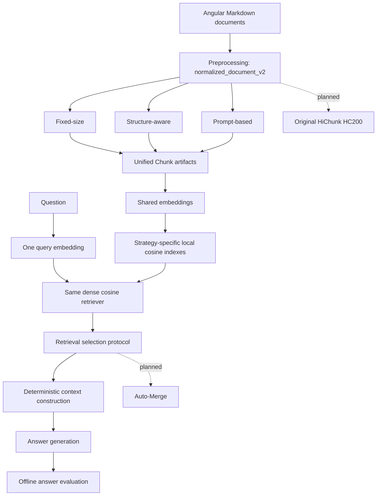

# Structure-Aware Chunking for RAG

This repository compares chunking strategies for an Angular technical-document corpus. Code, tests, configuration, and committed artifacts are authoritative. The final evidence-aware QA benchmark is **not yet executed** because the delivered team dataset has not passed the strict evidence-to-chunk compatibility gate.

## Current Status

| Component | Status | Notes |
|---|---|---|
| Preprocessing | Implemented | `normalized_document_v2`; current processed artifact has 384 documents. |
| Fixed-size chunking | Implemented and artifacted | `fixed_size`, default 512 tokens and 64-token overlap. |
| Structure-aware chunking | Implemented and artifacted | `structure_aware`, 512-token maximum and no overlap. |
| Prompt-based chunking | Implemented and artifacted | `prompt_based`; block-boundary planning, not sentence-ID hierarchy prediction. |
| Embedding and indexing | Implemented and artifacted | Shared embedding config and local cosine indexes. |
| Dense retrieval | Implemented and historically executed | One controlled retriever for every chunking strategy. |
| Historical source-level benchmark | Completed | 64 queries and 79 relative-path labels; not canonical QA. |
| Retrieval budget protocols | Implemented | Post-ranking selection policies. |
| Evidence-aware retrieval evaluation | Implemented; production run pending | Requires canonical QA data. |
| Context construction | Implemented | Deterministic formatter over selected hits. |
| Answer generation | Implemented; production run pending | Operator explicitly selects a production model. |
| Deterministic answer evaluation | Implemented; production run pending | Offline lexical evaluation of committed generation artifacts. |
| Original HiChunk (HC200) | Not implemented | No chunker, CLI, test, config, or artifact. |
| Auto-Merge / hierarchical retrieval | Not implemented | Planned extension only. |

Artifact counts are properties of the checked-in artifacts, not universal implementation constants. See [PREPROCESSING.md](PREPROCESSING.md), [EMBEDDING_INDEXING.md](EMBEDDING_INDEXING.md), and artifact manifests for identities.

## Implemented Pipeline



Solid nodes and arrows are implemented. Dashed nodes are planned and not part of the current comparison. The final benchmark compares `fixed_size`, `structure_aware`, and `prompt_based` using the same dense ranking, one pinned protocol/configuration, identical context construction, and one pinned generation configuration.

## Corpus and Preprocessing

The current corpus is 384 Angular Markdown documents. The parser uses `markdown-it-py` plus an Angular-specific adapter and emits `normalized_document_v2`. Blocks include headings, paragraphs, code blocks, lists, blockquotes, tables, callouts, HTML blocks, code references, and custom blocks. Source order, one-based source lines, headings, container paths, table/list metadata, links, sentence/provenance metadata, and unresolved `docs-code` references are retained and validated.

Unresolved external code references are represented explicitly rather than inventing source text. The checked-in processed manifest reports 920 unresolved references and three documents with warnings; these are audit warnings, not silently substituted content.

```bash
preprocess-angular --input data/raw/angular --output data/processed/angular
```

## Chunking

All strategies write the shared `Chunk` contract to `chunks.jsonl`, with manifest-last artifact commitment. Required fields are:

```text
chunk_id, strategy, doc_id, source, relative_path, chunk_index, text,
token_start, token_end, token_count, chunk_size, chunk_overlap, tokenizer
```

`level`, `parent_id`, `children_ids`, `title_path`, and JSON-safe `metadata` are serialized fields with defaults. `token_start` and `token_end` are both null or a half-open token span. Hierarchy fields are general schema fields, not a claim that every strategy creates a parent/child hierarchy; provenance detail is strategy-specific metadata.

### Fixed-size: `fixed_size`

`FixedSizeChunker` linearizes normalized block text in source order using `\n\n`, tokenizes with `tiktoken:cl100k_base`, and emits UTF-8-safe contiguous windows. The default configuration in `configs/chunking.yaml` is a 512-token window, 64-token overlap, and 448-token stride. The final window is not padded or merged. It does not use headings, hierarchy, or an LLM.

```bash
chunk-fixed --input data/processed/angular/documents.jsonl \
  --output data/chunks/angular/fixed_size --chunk-size 512 --chunk-overlap 64
```

The checked-in artifact contains 1,300 chunks.

### Structure-aware: `structure_aware`

`StructureAwareChunker` builds a Markdown heading stack, keeps heading-path provenance, and packs atomic blocks greedily in local section/source order. Sibling sections are never merged. Oversized prose uses sentence boundaries; code, lists, tables, and custom blocks use line/item/row boundaries before a UTF-8-safe token fallback. It uses `tiktoken:cl100k_base`, a 512-token maximum, and no content overlap.

```bash
chunk-structure --input data/processed/angular/documents.jsonl \
  --output data/chunks/angular/structure_aware --max-chunk-tokens 512
```

The checked-in artifact contains 3,162 chunks.

### Prompt-based: `prompt_based`

The current implementation is a **block-boundary planner**, not the older sentence-ID / hierarchy-level prediction design associated with HiChunk. `PromptBasedChunker` supplies bounded source-ordered normalized-block candidates to an LLM and accepts only strict JSON contiguous block ranges. Local code then slices exact normalized source, enforces the 512-token limit, and validates coverage, order, source hashes, and provenance. The model never provides authoritative chunk text or generated table headers.

Oversized prose/blockquote blocks split at sentence boundaries; code, lists, tables, and custom blocks split at lines. An indivisible unit falls back to the UTF-8-safe token policy. Prompt groups may cross heading boundaries, recorded in metadata.

The live planner is an OpenRouter Chat Completions adapter. Defaults are OpenRouter, `deepseek/deepseek-v4-flash-0731:nitro`, temperature 0, no seed, `prompt_based_v2`, and `prompt_boundary_plan_v1`. It requests JSON Schema output and can retry transport in prompt-enforced JSON-only mode; strict local parsing remains authoritative. Valid cached plans are reusable, while retry exhaustion fails the affected document. Tests use fakes and do not need the network.

```bash
chunk-prompt --input data/processed/angular/documents.jsonl \
  --output data/chunks/angular/prompt_based \
  --cache data/chunks/angular/prompt_based/cache
```

The existing prompt artifact is historical: it contains 2,054 chunks and records `prompt_based_v1`. It must not be described as produced with the current `prompt_based_v2` default without regeneration. Prompt-based chunking is implemented, but is not registered in the config-driven `chunk-documents` orchestrator; use `chunk-prompt`.

### Planned reference method

Original HiChunk / HC200 is research inspiration only. It is **not implemented** in this repository and is not part of the executable final comparison.

## Embeddings and Retrieval

`configs/embedding.yaml` pins the shared embedding configuration: OpenRouter, `openai/text-embedding-3-small`, dimension 1536, `cl100k_base`, and the `local_cosine_jsonl` backend. Each strategy gets its own chunk/embedding/index artifact lineage, but all use that same embedding configuration.

The main controlled experiment has **one base retriever**:

```text
trimmed query -> query embedding -> local cosine search -> score-desc, chunk_id-asc ranking
```

`RetrievalService` validates embedding/index manifests and resolves canonical hits. `LocalCosineIndex` uses cosine similarity and breaks exact score ties by ascending `chunk_id`. Only the strategy's chunk/index contents vary.

```bash
embed-chunks --input data/chunks/angular/fixed_size \
  --output data/embeddings/angular/fixed_size/<embedding-fingerprint> \
  --cache data/embedding-cache/<embedding-fingerprint> --corpus angular
build-vector-index --input data/embeddings/angular/fixed_size/<embedding-fingerprint> \
  --output data/indexes/angular/fixed_size/<embedding-fingerprint>
retrieve --corpus angular --strategy fixed_size \
  --query "How does dependency injection work?" --top-k 5
```

### Selection protocols, not retrievers

Both protocols operate on the same dense ranked candidates and preserve that order:

| Protocol | Semantics |
|---|---|
| `same_top_k` | Select the first `top_k` candidates. Default `top_k` is 5. |
| `same_token_budget` | Scan up to `candidate_k` candidates (default 50), selecting whole chunks whose persisted `token_count` fits the token budget (default 2048). |

For `same_token_budget`, metadata and context separators are excluded from retrieval accounting, text is never truncated, an oversized rank-one chunk is selected and flagged, and a later non-fitting chunk is skipped while scanning continues. The candidate depth, budget, `cl100k_base`, and whole-chunk policy are part of protocol identity. These are not separate retrieval algorithms.

BM25, hybrid, query-rewrite, diversity, and dense-depth commands in `rag_chunking.tuning` are historical tuning/ablation tooling. They are not part of the main controlled chunking comparison.

### Historical source-level retrieval benchmark

`data/evaluation/angular/baseline_v1.jsonl` is a frozen diagnostic dataset with 64 natural-language queries in eight categories and 79 binary labels at canonical `relative_path` level. It is not answer/evidence QA. Its implemented metrics are Hit@1/3/5/10, MRR (first relevant source), and distinct-source Recall@5/10. Historical results and methodology are in [RETRIEVAL_BASELINE_REPORT.md](RETRIEVAL_BASELINE_REPORT.md) and [RETRIEVAL_EVALUATION.md](RETRIEVAL_EVALUATION.md).

### Evidence-aware retrieval

The evidence evaluator maps source-grounded QA evidence to chunks and reports `evidence_coverage` plus `all_evidence_retrieved_rate` (macro aggregate). It supports both selection protocols. The real dataset must pass the compatibility gate below before this evaluator may run; no result from that dataset exists yet.

```bash
evaluate-evidence-retrieval --corpus angular \
  --dataset data/evaluation/angular/qa_dataset.jsonl --plan-only
```

## Canonical QA Dataset and Final-Benchmark Readiness

The team-provided gold dataset is the immutable upstream file `data/evaluation/angular/qa_dataset.jsonl`. Its `question_id`, `question`, and `reference_answer` fields adapt to canonical `id`, `question`, and `answer`; `difficulty`, `question_type`, `reasoning_type`, and all metadata are retained. Each nested evidence item remains attached to its `evidence_id`, document, section path, and sentence list, including cross-document questions. The adapter schema is `team_evidence_qa_adapter_v1`; it does not rewrite the source file.

The earlier `evidence_qa_dataset_v1` single-document contract remains supported for synthetic/development fixtures, but it is not the real team benchmark. The historical `baseline_v1.jsonl` is a 64-query source-level retrieval diagnostic and likewise is not the real benchmark.

Run the offline gate explicitly:

```bash
audit-dataset-compatibility \
  --dataset data/evaluation/angular/qa_dataset.jsonl \
  --output data/evaluation/angular/compatibility/qa_dataset

reconcile-qa-dataset \
  --dataset data/evaluation/angular/qa_dataset.jsonl \
  --compatibility data/evaluation/angular/compatibility/qa_dataset
```

Document IDs first require exact canonical identity (the real IDs already match `angular:<relative_path>`). A missing namespace may only be added through the unique, explicit `source + relative_path` transformation; filename-only and fuzzy matches are forbidden. Sections use exact path/suffix matching, then NFKC/case/whitespace plus Markdown heading-delimiter normalization. Evidence uses exact block text, then deterministic NFKC/case/whitespace and rendered-Markdown normalization with exact source offsets. Chunk relevance comes only from those offsets and committed unified-chunk provenance.

The strict gate passes only when every schema field, document, section, evidence sentence, and evidence item resolves uniquely and maps completely for every selected strategy, with valid corpus/chunk lineage. Failures are never dropped. Machine-readable reports and the detailed unresolved list are under `data/evaluation/angular/compatibility/qa_dataset/`.

Reconciliation consumes that fingerprinted unresolved queue and writes lexical candidates and human-review proposals under `compatibility/qa_dataset/reconciliation/`. It never edits the immutable QA file, uses retrieval results, or changes gate truth.

The legacy loader contract accepts:

```text
id, doc_id, question, answer, evidence_sentences, evidence_sections,
question_type, difficulty
```

`notes` is optional. `question_type` and `difficulty` are non-empty, open-ended strings; T0/T1/T2 are **not enforced**, and no production query count is hard-coded. Evidence sentences can be strings or objects with required `text` and optional `block_index`; `char_start` and `char_end` must appear together with `block_index` and are zero-based half-open offsets. The loader validates source document IDs, IDs, JSON shape, required fields, and semantic evidence consistency without repairing authored content.

```text
QA record -> retrieval: id + question
          -> generation: id + question + ContextResult
          -> evaluation: answer/evidence/category/difficulty metadata
```

The real benchmark remains closed until the compatibility report says `PASS`. Test fixtures are development plumbing only and must not be used for research results. Details are in [FINAL_BENCHMARK_HANDOFF.md](FINAL_BENCHMARK_HANDOFF.md).

## Context Construction and Generation

`ContextBuilder` consumes authoritative protocol-selected `RetrievalHit` values; it does not retrieve, rerank, transform, deduplicate, or truncate chunks. It preserves retrieval rank and renders:

```text
[CONTEXT 1]
<chunk text>

[CONTEXT 2]
<chunk text>
```

The separator is `\n\n`; duplicate chunk IDs are rejected while duplicate text is preserved. The rendered context budget defaults to 4096 `cl100k_base` tokens. If labels/separators make the rendered context exceed the budget, construction fails; it does not trim. This is separate from the retrieval token budget and counts rendered labels/separators as well as text.

Generation consumes serialized `ContextResult` JSONL, not a retriever. The frozen prompt is a system instruction to use only supplied context plus a user message containing Question, Context, and Answer. `GenerationConfig` defaults to temperature 0, max output 512, and context window 8192; it accounts for prompt framing and fails before provider invocation when input plus output allowance exceeds the window. The implementation provides deterministic fake and OpenRouter providers, bounded retries, content-addressed caching, fingerprints, partial failure artifacts, and manifest-last commitment.

The default CLI uses the fake provider/model. A production model is deliberately not selected by the repository: use `--provider openrouter --model <pinned-model>` only after the canonical dataset and preflight are ready.

## Answer Evaluation

`evaluate-answers` is offline and consumes only canonical QA data plus complete committed generation runs. It neither retrieves, rebuilds context, calls a provider, nor fills missing answers. Implemented metrics are:

- `normalized_exact_match`: Unicode NFKC, casefold, and whitespace-collapse equality.
- `token_precision`, `token_recall`, `token_f1`: multiset overlap of normalized Unicode word-or-symbol tokens.
- `normalized_containment`: secondary contiguous-reference-token diagnostic.

The evaluator reports successful-answer means and end-to-end zero-filled means with explicit failed/missing denominators, including exact `question_type` groups. It writes `evaluations.jsonl`, `summary.json`, `paired.jsonl`, `stats.json`, then `manifest.json`.

ROUGE-L, BERTScore, semantic similarity, LLM judging, Fact-Cov, and automatic faithfulness/hallucination metrics are **not implemented** and are not current official metrics or result-table columns. See [ANSWER_EVALUATION.md](ANSWER_EVALUATION.md) for the offline contract.

## CLI Reference

Registered console scripts are defined in `pyproject.toml`. Core workflow:

```bash
preprocess-angular --input data/raw/angular --output data/processed/angular
chunk-fixed --input data/processed/angular/documents.jsonl --output data/chunks/angular/fixed_size
chunk-structure --input data/processed/angular/documents.jsonl --output data/chunks/angular/structure_aware
chunk-prompt --input data/processed/angular/documents.jsonl --output data/chunks/angular/prompt_based --cache data/chunks/angular/prompt_based/cache
evaluate-retrieval --corpus angular --dataset data/evaluation/angular/baseline_v1.jsonl --plan-only
validate-qa-dataset --dataset data/evaluation/angular/qa_dataset.jsonl --documents data/processed/angular/documents.jsonl
audit-dataset-compatibility --dataset data/evaluation/angular/qa_dataset.jsonl
reconcile-qa-dataset --dataset data/evaluation/angular/qa_dataset.jsonl
benchmark-preflight
prepare-answer-inputs --dataset data/evaluation/angular/qa_dataset.jsonl --output <inputs-dir>
generate-answers --input <inputs.jsonl> --output <generation-dir> --cache <cache-dir>
evaluate-answers --dataset data/evaluation/angular/qa_dataset.jsonl --documents data/processed/angular/documents.jsonl --prepared-inputs <inputs-dir> --generation fixed_size=<dir> --generation structure_aware=<dir> --generation prompt_based=<dir> --output <evaluation-dir>
```

`prepare-answer-inputs` defaults to `cache_only` embedding mode to avoid accidental network/API use; use `--embedding-mode openrouter` only for an approved production run. Use each command's `--help` and the linked handoff documents before any credentialed or regenerating operation.

## Related Documentation

- [PREPROCESSING.md](PREPROCESSING.md): parser, normalized schema, provenance, and migration details.
- [EMBEDDING_INDEXING.md](EMBEDDING_INDEXING.md): embedding/index artifact and cache contracts.
- [RETRIEVAL_PROTOCOL_AUDIT.md](RETRIEVAL_PROTOCOL_AUDIT.md): controlled protocol and compatibility audit.
- [RETRIEVAL_BASELINE_REPORT.md](RETRIEVAL_BASELINE_REPORT.md): completed historical source-level results.
- [RETRIEVAL_TUNING_REPORT.md](RETRIEVAL_TUNING_REPORT.md): tuning/ablation evidence, not the main retriever.
- [ANSWER_EVALUATION.md](ANSWER_EVALUATION.md): answer evaluator contract.
- [FINAL_BENCHMARK_HANDOFF.md](FINAL_BENCHMARK_HANDOFF.md): canonical QA handoff and production-run gate.
